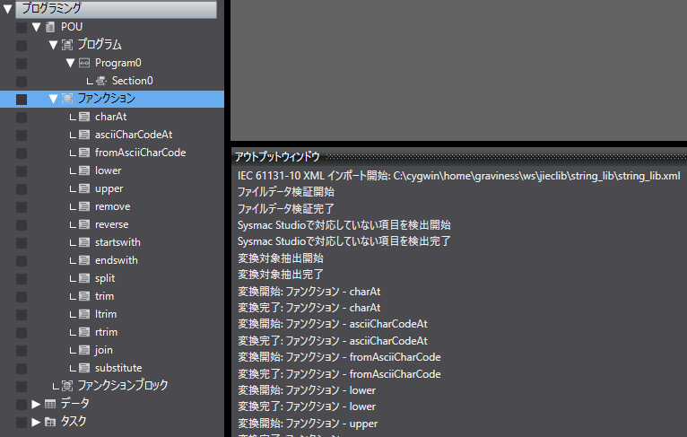

# JiecLib

## 概要

JiecLibは、<a href="https://www.graviness.com/iec_61131-3/">IEC 61131-3 ST言語</a>のライブラリです。

特徴は、テスト対象POUのソースコード、および、その単体テストコードがIEC 61131-3 ST言語を拡張したテキスト形式で完結していることです。このため、すべてがダイレクトにGit等で構成管理が可能です。使用するIDEによっては生成AIを使ってIEC 61131-3プログラミングできます。

このテキスト形式のコードをPLCメーカーのツールで取り込み可能な形式に変換するために、[IEC 61131-3 ⇄ IEC 61131-10変換ソフトウェア Jiecc](https://www.graviness.com/iec_61131-3/jiecc.html)を使用します。

現在、JiecLibは[IEC 61131-10 XML](https://plcopen.org/sites/default/files/downloads/iec_61131-10_preview.pdf)をサポートするオムロン社製の[Sysmac Studio](https://www.fa.omron.co.jp/products/family/3077/download/software.html)を対象にしています。

## 必要環境

オムロン社製のSysmac Studioを使用して、JiecLib内のライブラリを使用するために必要な環境は以下の通りです。

* [Jiecc 4.22以降](https://www.graviness.com/iec_61131-3/jiecc.html#Header.Jiecc%E3%81%AE%E3%83%80%E3%82%A6%E3%83%B3%E3%83%AD%E3%83%BC%E3%83%89%E3%81%A8%E5%AE%9F%E8%A1%8C%E6%96%B9%E6%B3%95)
  * Jieccは、IEC 61131-3テキストをIEC 61131-10 XMLに変換するコマンドラインベースで無料のソフトウェアです。[Jieccのダウンロードと実行方法](https://www.graviness.com/iec_61131-3/jiecc.html#Header.Jiecc%E3%81%AE%E3%83%80%E3%82%A6%E3%83%B3%E3%83%AD%E3%83%BC%E3%83%89%E3%81%A8%E5%AE%9F%E8%A1%8C%E6%96%B9%E6%B3%95)から最新のJieccをダウンロードできます。
* [Sysmac Studio](https://www.fa.omron.co.jp/products/family/3077/download/software.html)
  * 高価なソフトウェアですが、Sysmac Studioに同梱されているシミュレータでテストが可能です。必要に応じて、PLC本体も入手してください。

## Sysmac StudioでJiecLib内のライブラリを取り込む方法

Sysmac StudioでJiecLib内のライブラリを取り込む方法について、[string_lib](./string_lib/string_lib.txt)を例として示します。

1. 次のコマンドを実行します。

`<JiecLib Project Root>`は適宜プロジェクトをダウンロードしたディレクトリに変更してください。また、事前にjiecc.exeを`<JiecLib Project Root>`直下におくか、jieccがあるディレクトリへパスを通しておいてください。

```
$ cd <JiecLib Project Root>
$ jiecc ./string_lib/string_lib.txt -t omron -o ./string_lib/string_lib.xml
```

`./string_lib/string_lib.xml`が出力されます。

2. 出力された`string_lib.xml`をSysmac StudioのIEC 61131-10インポート機能でインポートします（ツール|IEC 61131-10 XML|インポート）。



[string_lib](./string_lib/string_lib.txt)に含まれるPOU群（charAtファンクション, lowerファンクション, ...）がインポートされます。

## JiecLibに含まれるライブラリ

JiecLibに含まれるライブラリとIEC 61131-10 XMLを生成するためのコマンドを示します。

* [base64](./base64)
** メール等で使用されているエンコード方式Base64です。
** `jiecc ./base64/base64.txt -Istring_lib -t omron -o ./base64/base64.xml`
* [mersenne_twister](./mersenne_twister)
** 疑似乱数生成アルゴリズムメルセンヌ・ツイスタです。
** `jiecc ./mersenne_twister/mersenne_twister.txt -t omron -o ./mersenne_twister/mersenne_twister.xml`
* [ringbuffer](./ringbuffer)
** リングバッファです。バッファのデータ型を簡単に拡張できます。
** `jiecc ./ringbuffer/ringbuffer.txt -t omron -o ./ringbuffer/ringbuffer.xml`
* [string_lib](./string_lib)
** 基本的な文字列操作ライブラリです。
** `jiecc ./string_lib/string_lib.txt -t omron -o ./string_lib/string_lib.xml`
* [xorshift32](./xorshift32)
** 疑似乱数生成アルゴリズムxorshiftです。
** `jiecc ./xorshift32/xorshift32.txt -t omron -o ./xorshift32/xorshift32.xml`

## JiecLib開発者向け

### JiecLibのテスト方法

JiecLibの単体テストに[JiecUnit](https://github.com/yunos0987/jiecunit)を使用します。次のディレクトリ構成として説明します。テストコードは、[jieclib/test](./test)に含まれます。

```
jiecunit/
jieclib/
  base64/
  string_lib/
  :
  test/
  :
```

1. 次のコマンドを実行します。

```
$ cd <JiecLib Project Root>
$ jiecc ./test/string_lib/test_string_lib.txt -I../jiecunit -I../jiecunit/sys -t omron -o ./test/string_lib/test_string_lib.xml
```

`./test/string_lib/test_string_lib.xml`が生成されます。

2. [単体テストのサンプルの実行方法の手順2](https://github.com/yunos0987/jiecunit#%E5%8D%98%E4%BD%93%E3%83%86%E3%82%B9%E3%83%88%E3%81%AE%E3%82%B5%E3%83%B3%E3%83%97%E3%83%AB%E3%81%AE%E5%AE%9F%E8%A1%8C%E6%96%B9%E6%B3%95)以降を実行します。

## ライセンス

このプロジェクトはApache License 2.0の下でライセンスされています。詳細は[LICENSE](./LICENSE)ファイルを参照してください。
