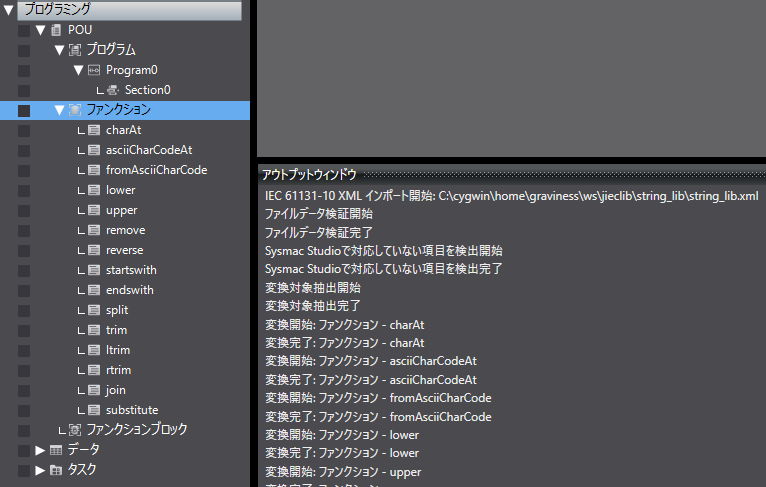

# JiecLib

## 目次

- [概要](#概要)
- [必要環境](#必要環境)
- [Sysmac StudioでJiecLib内のライブラリを取り込む方法](#sysmac-studioでjieclib内のライブラリを取り込む方法)
- [JiecLibに含まれるライブラリ](#jieclibに含まれるライブラリ)
  - [array](#array)
  - [encoding](#encoding)
  - [compress](#compress)
  - [bitset](#bitset)
  - [hash](#hash)
  - [container](#container)
  - [math](#math)
  - [vector](#vector)
  - [linalg](#linalg)
  - [random](#random)
  - [stats](#stats)
  - [string\_lib](#string_lib)
- [JiecLib開発者向け](#jieclib開発者向け)
  - [サブモジュール含むリポジトリのクローン方法](#サブモジュール含むリポジトリのクローン方法)
  - [JiecLibのテスト方法](#jieclibのテスト方法)
- [ライセンス](#ライセンス)

## 概要

JiecLibは、<a href="https://www.graviness.com/iec_61131-3/">IEC 61131-3 ST言語</a>のライブラリです。

特徴は、テスト対象POUのソースコード、および、その単体テストコードがIEC 61131-3 ST言語を拡張したテキスト形式で完結していることです。このため、すべてがダイレクトにGit等で構成管理が可能です。使用するIDEによっては生成AIを使ってIEC 61131-3プログラミングできます。

このテキスト形式のコードをPLCメーカーのツールで取り込み可能な形式に変換するために、[IEC 61131-3 ⇄ IEC 61131-10変換ソフトウェア Jiecc](https://www.graviness.com/iec_61131-3/jiecc.html)を使用します。

現在、JiecLibは[IEC 61131-10 XML](https://plcopen.org/sites/default/files/downloads/iec_61131-10_preview.pdf)をサポートするオムロン社製の[Sysmac Studio](https://www.fa.omron.co.jp/products/family/3077/download/software.html)を対象にしています。

## 必要環境

オムロン社製のSysmac Studioを使用して、JiecLib内のライブラリを使用するために必要な環境は以下の通りです。

* [Jiecc 5.14以降](https://www.graviness.com/iec_61131-3/jiecc.html#Header.Jiecc%E3%81%AE%E3%83%80%E3%82%A6%E3%83%B3%E3%83%AD%E3%83%BC%E3%83%89%E3%81%A8%E5%AE%9F%E8%A1%8C%E6%96%B9%E6%B3%95)
  * Jieccは、IEC 61131-3テキストをIEC 61131-10 XMLに変換するコマンドラインベースで無料のソフトウェアです。[Jieccのダウンロードと実行方法](https://www.graviness.com/iec_61131-3/jiecc.html#Header.Jiecc%E3%81%AE%E3%83%80%E3%82%A6%E3%83%B3%E3%83%AD%E3%83%BC%E3%83%89%E3%81%A8%E5%AE%9F%E8%A1%8C%E6%96%B9%E6%B3%95)から最新のJieccをダウンロードできます。
* [Sysmac Studio](https://www.fa.omron.co.jp/products/family/3077/download/software.html)
  * 高価なソフトウェアですが、Sysmac Studioに同梱されているシミュレータでテストが可能です。必要に応じて、PLC本体も入手してください。

## Sysmac StudioでJiecLib内のライブラリを取り込む方法

Sysmac StudioでJiecLib内のライブラリを取り込む方法について、[string_lib](./src/string_lib/string_lib.txt)を例として示します。

1. 次のコマンドを実行し、JiecLibプロジェクトをクローンとサブモジュールを初期化します。

```
$ git clone https://github.com/yunos0987/jieclib.git
$ cd jieclib
$ git submodule update --init --recursive
```

※一部のライブラリが、[JiecUnit](https://github.com/yunos0987/jiecunit)内のモジュールに依存しており、サブモジュールの初期化を必要とします。

2. 次のコマンドを実行します。事前に[jiecc.exe](https://www.graviness.com/iec_61131-3/jiecc.html#Header.Jiecc%E3%81%AE%E3%83%80%E3%82%A6%E3%83%B3%E3%83%AD%E3%83%BC%E3%83%89%E3%81%A8%E5%AE%9F%E8%A1%8C%E6%96%B9%E6%B3%95)をjieclibディレクトリ直下におくか、jieccがあるディレクトリへパスを通しておいてください。

```
$ jiecc ./src/string_lib/string_lib.txt -I./src -o ./src/string_lib/string_lib.xml -t omron
```

`./src/string_lib/string_lib.xml`が出力されます。

※xmlを生成するためのコマンドは、ライブラリごとに違います。各ライブラリ（*.txt）の先頭にxmlを生成するためのコマンドを記載しています。

3. 出力された`./src/string_lib/string_lib.xml`をSysmac StudioのIEC 61131-10インポート機能 [ ツール | IEC 61131-10 XML | インポート ] でインポートします。



[string_lib](./src/string_lib/string_lib.txt)に含まれるPOU群（charAtファンクション, lowerファンクション, ...）がインポートされます。

## JiecLibに含まれるライブラリ

JiecLibに含まれるライブラリと、IEC 61131-10 XMLを生成するためのコマンドを示します。

### [array](./src/array)

基本的な配列操作ライブラリです。

IEC 61131-10 XML生成コマンド: `jiecc ./src/array/array.txt -I./src -o ./src/array/array.xml -t omron`

* **配列判定（正規配列）**
  * [Array_isRegular_lreal](./src/array/array.txt) / [Array_isRegular_dint](./src/array/array.txt): 1次元配列の正規性判定
  * [Array_isRegular2d_x_lreal](./src/array/array.txt) / [Array_isRegular2d_x_dint](./src/array/array.txt): 2次元配列の次元ごとの正規性判定
  * [Array_isRegular2d_lreal](./src/array/array.txt) / [Array_isRegular2d_dint](./src/array/array.txt): 2次元配列の正規性判定
* **コピー**
  * [Array_copy_lreal](./src/array/copy.txt) / [Array_copy_dint](./src/array/copy.txt): 全要素コピー
  * [Array_copy_x_lreal](./src/array/copy.txt) / [Array_copy_x_dint](./src/array/copy.txt): 範囲指定コピー
* **埋め込み**
  * [Array_fill_lreal](./src/array/fill.txt) / [Array_fill_dint](./src/array/fill.txt): 全要素を指定値で埋める
* **反転**
  * [Array_reverse_lreal](./src/array/reverse.txt) / [Array_reverse_dint](./src/array/reverse.txt): 配列をin-placeで逆順にする
* **回転**
  * [Array_rotate_lreal](./src/array/rotate.txt) / [Array_rotate_dint](./src/array/rotate.txt): 配列をin-placeで回転する（正のshiftで左回転、負で右回転）
* **インデックス検索・存在判定**
  * [Array_index_of_lreal](./src/array/search.txt) / [Array_index_of_dint](./src/array/search.txt): 値の最初の出現インデックスを返す（見つからない場合は -1）
  * [Array_last_index_of_lreal](./src/array/search.txt) / [Array_last_index_of_dint](./src/array/search.txt): 値の最後の出現インデックスを返す（見つからない場合は -1）
  * [Array_contains_lreal](./src/array/search.txt) / [Array_contains_dint](./src/array/search.txt): 値が含まれるか判定する
* **集計**
  * [Array_min_lreal](./src/array/aggregate.txt) / [Array_min_dint](./src/array/aggregate.txt): 最小値を返す
  * [Array_max_lreal](./src/array/aggregate.txt) / [Array_max_dint](./src/array/aggregate.txt): 最大値を返す
  * [Array_min_index_lreal](./src/array/aggregate.txt) / [Array_min_index_dint](./src/array/aggregate.txt): 最小値の配列インデックスを返す
  * [Array_max_index_lreal](./src/array/aggregate.txt) / [Array_max_index_dint](./src/array/aggregate.txt): 最大値の配列インデックスを返す
* **等価判定**
  * [Array_equals_lreal](./src/array/equivalence.txt) / [Array_equals_dint](./src/array/equivalence.txt): 2つの配列が等しいか判定する
* **ソート**
  * [Array_bubblesort_lreal](./src/array/sort.txt) / [Array_bubblesort_dint](./src/array/sort.txt): バブルソート
  * [Array_mergesort_lreal](./src/array/sort.txt) / [Array_mergesort_dint](./src/array/sort.txt): マージソート
  * [Array_quicksort_lreal](./src/array/sort.txt) / [Array_quicksort_dint](./src/array/sort.txt): クイックソート

### [encoding](./src/encoding)

エンコーディング関連ライブラリです。

* **Base64**
  * [base64encode](./src/encoding/base64.txt) / [base64decode](./src/encoding/base64.txt)
  * IEC 61131-10 XML生成コマンド: `jiecc ./src/encoding/base64.txt -I./src -o ./src/encoding/base64.xml -t omron`
* **Base64URL**（RFC 4648 §5、URL-safe・パディングなし）
  * [base64url_encode](./src/encoding/base64url.txt) / [base64url_decode](./src/encoding/base64url.txt)
  * JWT・OAuth2 などの Web API で使われる `-`/`_` ベースの Base64 亜種
  * IEC 61131-10 XML生成コマンド: `jiecc ./src/encoding/base64url.txt -I./src -o ./src/encoding/base64url.xml -t omron`
* **Percent（URLエンコード）**
  * [percentencode](./src/encoding/percent.txt) / [percentdecode](./src/encoding/percent.txt)
  * IEC 61131-10 XML生成コマンド: `jiecc ./src/encoding/percent.txt -I./src -o ./src/encoding/percent.xml -t omron`
* **Hex**
  * [hexencode](./src/encoding/hex.txt) / [hexdecode](./src/encoding/hex.txt)
  * IEC 61131-10 XML生成コマンド: `jiecc ./src/encoding/hex.txt -I./src -o ./src/encoding/hex.xml -t omron`
* **JSON文字列エスケープ**（RFC 8259）
  * [json_escape](./src/encoding/json_string.txt) / [json_unescape](./src/encoding/json_string.txt)
  * REST API へ JSON ペイロードを送信する際の文字列値のエスケープ／アンエスケープ
  * IEC 61131-10 XML生成コマンド: `jiecc ./src/encoding/json_string.txt -I./src -o ./src/encoding/json_string.xml -t omron`
* **BCD（Packed BCD）**
  * [bcd_encode](./src/encoding/bcd.txt) / [bcd_decode](./src/encoding/bcd.txt)
  * HMI・計量器・Modbus 機器など産業機器との通信で使われる Packed BCD 形式
  * IEC 61131-10 XML生成コマンド: `jiecc ./src/encoding/bcd.txt -I./src -o ./src/encoding/bcd.xml -t omron`

### [compress](./src/compress)

データ圧縮ライブラリです。入力配列を `dat`、出力配列を `dst` という名前の `var_in_out` 引数で渡し、戻り値は `dst` に書き込んだバイト数（dint型）です。

* **RLE（PackBits ランレングス符号化）**
  * [rle_encode](./src/compress/rle.txt) / [rle_decode](./src/compress/rle.txt)
  * `offset`/`length` で入力範囲、`dst_offset` で出力先オフセットを指定可能
  * IEC 61131-10 XML生成コマンド: `jiecc ./src/compress/rle.txt -I./src -o ./src/compress/rle.xml -t omron`
* **Huffman（動的ハフマン符号化）**
  * [huffman_encode](./src/compress/huffman.txt) / [huffman_decode](./src/compress/huffman.txt)
  * 出力形式: 先頭4バイト（元データ長、big-endian）＋256バイト（符号長テーブル）＋ビットストリーム（MSBファースト）
  * `offset`/`length` で入力範囲を指定可能
  * IEC 61131-10 XML生成コマンド: `jiecc ./src/compress/huffman.txt -I./src -o ./src/compress/huffman.xml -t omron`

### [bitset](./src/bitset)

32ビット整数（DWORD）をビット集合として扱うライブラリです。個々のビットの設定・取得から、ビットフィールドの抽出・挿入まで対応します。

| 関数 | 説明 |
|---|---|
| [bitset_set](./src/bitset/bitset.txt) | 指定ビットを 1 にする |
| [bitset_clear](./src/bitset/bitset.txt) | 指定ビットを 0 にする |
| [bitset_test](./src/bitset/bitset.txt) | 指定ビットが 1 か判定する |
| [bitset_toggle](./src/bitset/bitset.txt) | 指定ビットを反転する |
| [bitset_popcount](./src/bitset/bitset.txt) | セットされているビット数を返す |
| [bitset_ffs](./src/bitset/bitset.txt) | 最下位の 1-bit の位置を返す（ない場合は -1） |
| [bitset_ffc](./src/bitset/bitset.txt) | 最下位の 0-bit の位置を返す（ない場合は -1） |
| [bitset_extract](./src/bitset/bitset.txt) | ビットフィールド [pos, pos+width-1] を右詰めで抽出する |
| [bitset_insert](./src/bitset/bitset.txt) | 右詰め値をビットフィールド [pos, pos+width-1] に埋め込む |

IEC 61131-10 XML生成コマンド: `jiecc ./src/bitset/bitset.txt -I./src -o ./src/bitset/bitset.xml -t omron`

### [hash](./src/hash)

ハッシュ関連ライブラリです。

* **CRC32**
  * [CRC32_string](./src/hash/crc32.txt): 文字列入力のCRC32
  * [CRC32_bytes](./src/hash/crc32.txt): バイト配列入力のCRC32（`offset`/`length`を指定）
  * IEC 61131-10 XML生成コマンド: `jiecc ./src/hash/crc32.txt -I./src -o ./src/hash/crc32.xml -t omron`
* **MD5**
  * [MD5_string](./src/hash/md5.txt): 文字列入力のMD5
  * [MD5_bytes](./src/hash/md5.txt): バイト配列入力のMD5（`offset`/`length`を指定）
  * IEC 61131-10 XML生成コマンド: `jiecc ./src/hash/md5.txt -I./src -o ./src/hash/md5.xml -t omron`
* **SHA-1**
  * [SHA1_string](./src/hash/sha1.txt): 文字列入力のSHA-1
  * [SHA1_bytes](./src/hash/sha1.txt): バイト配列入力のSHA-1（`offset`/`length`を指定）
  * IEC 61131-10 XML生成コマンド: `jiecc ./src/hash/sha1.txt -I./src -o ./src/hash/sha1.xml -t omron`
* **SHA-256**
  * [SHA256_string](./src/hash/sha256.txt): 文字列入力のSHA-256
  * [SHA256_bytes](./src/hash/sha256.txt): バイト配列入力のSHA-256（`offset`/`length`を指定）
  * IEC 61131-10 XML生成コマンド: `jiecc ./src/hash/sha256.txt -I./src -o ./src/hash/sha256.xml -t omron`
* **SHA-512**
  * [SHA512_string](./src/hash/sha512.txt): 文字列入力のSHA-512
  * [SHA512_bytes](./src/hash/sha512.txt): バイト配列入力のSHA-512（`offset`/`length`を指定）
  * IEC 61131-10 XML生成コマンド: `jiecc ./src/hash/sha512.txt -I./src -o ./src/hash/sha512.xml -t omron`

### [container](./src/container)

コンテナ系ライブラリ（`arraylist` / `linkedlist` / `dequeue` / `hashmap` / `orderedmap` / `linkedhashmap` / `hashset` / `orderedset` / `linkedhashset` / `stack` / `ringbuffer`）です。

#### arraylist（[arraylist_template](./src/container/arraylist/arraylist_template.txt)）

固定長配列ベースの可変長リスト（ArrayList）テンプレートです。

`#include` 時に要素型・最大容量・等価判定関数（任意）・ハッシュ関数（任意）を指定してインスタンス生成します。

| 関数 | 説明 |
|------|------|
| `init` | 初期化 |
| `len` | 要素数取得 |
| `empty` | 空判定 |
| `clear` | 全要素削除 |
| `append` | 末尾追加 |
| `insert` | 指定位置挿入 |
| `set` | 指定位置更新 |
| `remove` | 指定位置削除 |
| `get` | 指定位置取得 |
| `contains` | 要素存在判定 |
| `index` | 要素位置検索 |
| `values` | 全要素取得 |
| `copy` | コピー |
| `equals` | 等価判定 |
| `hash` | ハッシュ値計算（`ArrayListElementHashFunction` 指定時） |

テスト用XML生成コマンド: `jiecc ./test/container/arraylist/test_arraylist.txt -I./src -I./vendor/jiecunit -D_TEST_ -o ./test/container/arraylist/test_arraylist.xml -t omron`

#### linkedlist（[linkedlist_template](./src/container/linkedlist/linkedlist_template.txt)）

doubly linked list ベースの可変長リスト（LinkedList）テンプレートです。

`#include` 時に要素型・最大容量・等価判定関数（任意）・ハッシュ関数（任意）を指定してインスタンス生成します。

| 関数 | 説明 |
|------|------|
| `init` | 初期化 |
| `len` | 要素数取得 |
| `empty` | 空判定 |
| `clear` | 全要素削除 |
| `append` | 末尾追加 |
| `appendleft` | 先頭追加 |
| `insert` | 指定位置挿入 |
| `pop` | 末尾削除・取得 |
| `popleft` | 先頭削除・取得 |
| `remove` | 指定位置削除 |
| `get` | 指定位置取得 |
| `set` | 指定位置更新 |
| `contains` | 要素存在判定 |
| `index` | 要素位置検索 |
| `values` | 全要素取得 |
| `copy` | コピー |
| `equals` | 等価判定 |
| `hash` | ハッシュ値計算（`LinkedListElementHashFunction` 指定時） |

テスト用XML生成コマンド: `jiecc ./test/container/linkedlist/test_linkedlist.txt -I./src -I./vendor/jiecunit -D_TEST_ -o ./test/container/linkedlist/test_linkedlist.xml -t omron`

#### dequeue（[dequeue_template](./src/container/dequeue/dequeue_template.txt)）

固定長リングバッファベースの両端キュー（Dequeue）テンプレートです。

`#include` 時に要素型・容量マクロ（`DequeueCapacity`、任意）・等価判定関数（任意）・ハッシュ関数（任意）を指定してインスタンス生成します。

| 関数 | 説明 |
|------|------|
| `init` | 初期化（容量は`DequeueCapacity`使用） |
| `copy` | コピー |
| `append` | 末尾追加 |
| `appendleft` | 先頭追加 |
| `pop` | 末尾削除・取得 |
| `popleft` | 先頭削除・取得 |
| `first` | 先頭要素参照 |
| `last` | 末尾要素参照 |
| `contains` | 要素存在判定 |
| `elements` | 全要素取得 |
| `len` | 要素数取得 |
| `clear` | 全要素削除 |
| `empty` | 空判定 |
| `equals` | 等価判定 |
| `hash` | ハッシュ値計算（`DequeueItemHashFunction` 指定時） |

テスト用XML生成コマンド: `jiecc ./test/container/dequeue/test_dequeue.txt -I./src -I./vendor/jiecunit -D_TEST_ -o ./test/container/dequeue/test_dequeue.xml -t omron`

#### hashmap（[hashmap_template](./src/container/hashmap/hashmap_template.txt)）

Robin Hood hashing ベースの連想配列（HashMap）テンプレートです。

`#include` 時にマクロで型・容量・比較関数・ハッシュ関数を指定してインスタンス生成します。

| 関数 | 説明 |
|------|------|
| `init` | 初期化 |
| `copy` | コピー |
| `upsert` | 挿入または更新 |
| `lookup` | キー検索・値取得 |
| `delete` | キー削除 |
| `contains` | キー存在判定 |
| `len` | 要素数取得 |
| `keys` | 全キー取得 |
| `values` | 全値取得 |
| `items` | 全キー・値ペア取得 |
| `equals` | 等価判定 |
| `hash` | ハッシュ値計算（`HashMapValueHashFunction` 指定時） |
| `empty` | 空判定 |
| `clear` | 全要素削除 |

生成例（stringキー / dint値）:
```
{#define HashMapName mymap}
{#define HashMapCapacity 256}
{#define HashMapKeyType string[128]}
{#define HashMapKeyEqualsFunction String_equals}
{#define HashMapKeyHashFunction String_hash}
{#define HashMapValueType dint}
{#include <container/hashmap/hashmap_template.txt>}
```

テスト用XML生成コマンド: `jiecc ./test/container/hashmap/test_hashmap.txt -I./src -I./vendor/jiecunit -D_TEST_ -o ./test/container/hashmap/test_hashmap.xml -t omron`

#### orderedmap（[orderedmap_template](./src/container/orderedmap/orderedmap_template.txt)）

Robin Hood HashMap + 挿入順配列で順序維持する連想配列（OrderedMap）テンプレートです。

`#include` 時にキー/値型・キー比較関数・キーハッシュ関数・容量（任意）を指定してインスタンス生成します。

| 関数 | 説明 |
|------|------|
| `init` | 初期化 |
| `copy` | コピー |
| `upsert` | 挿入または更新 |
| `lookup` | キー検索・値取得 |
| `delete` | キー削除 |
| `contains` | キー存在判定 |
| `len` | 要素数取得 |
| `keys` | 全キー取得（挿入順） |
| `values` | 全値取得（挿入順） |
| `items` | 全キー・値ペア取得（挿入順） |
| `equals` | 等価判定 |
| `hash` | ハッシュ値計算（`OrderedMapValueHashFunction` 指定時） |
| `empty` | 空判定 |
| `clear` | 全要素削除 |

テスト用XML生成コマンド: `jiecc ./test/container/orderedmap/test_orderedmap.txt -I./src -I./vendor/jiecunit -D_TEST_ -o ./test/container/orderedmap/test_orderedmap.xml -t omron`

#### linkedhashmap（[linkedhashmap_template](./src/container/linkedhashmap/linkedhashmap_template.txt)）

Robin Hood HashMap + 双方向リンクで順序管理する連想配列（LinkedHashMap）テンプレートです。

`#include` 時にキー/値型・キー比較関数・キーハッシュ関数・容量（任意）・アクセス順モード（任意）を指定してインスタンス生成します。

| 関数 | 説明 |
|------|------|
| `init` | 初期化 |
| `copy` | コピー |
| `upsert` | 挿入または更新 |
| `lookup` | キー検索・値取得（アクセス順モード時は順序更新） |
| `delete` | キー削除 |
| `contains` | キー存在判定 |
| `len` | 要素数取得 |
| `keys` | 全キー取得（挿入順/アクセス順） |
| `values` | 全値取得（挿入順/アクセス順） |
| `items` | 全キー・値ペア取得（挿入順/アクセス順） |
| `equals` | 等価判定 |
| `hash` | ハッシュ値計算（`LinkedHashMapValueHashFunction` 指定時） |
| `empty` | 空判定 |
| `clear` | 全要素削除 |

テスト用XML生成コマンド: `jiecc ./test/container/linkedhashmap/test_linkedhashmap.txt -I./src -I./vendor/jiecunit -D_TEST_ -o ./test/container/linkedhashmap/test_linkedhashmap.xml -t omron`

#### hashset（[hashset_template](./src/container/hashset/hashset_template.txt)）

HashMapベースの集合（HashSet）テンプレートです。

`#include` 時に要素型・等価判定関数・ハッシュ関数・容量を指定してインスタンス生成します。

| 関数 | 説明 |
|------|------|
| `init` | 初期化 |
| `copy` | コピー |
| `add` | 要素追加 |
| `add_all` | 複数要素追加 |
| `remove` | 要素削除 |
| `remove_all` | 複数要素削除 |
| `contains` | 要素存在判定 |
| `len` | 要素数取得 |
| `elements` | 全要素取得 |
| `equals` | 等価判定 |
| `hash` | ハッシュ値計算 |
| `empty` | 空判定 |
| `clear` | 全要素削除 |

生成例（dint要素）:
```
{#define HashSetName myset}
{#define HashSetElementType dint}
{#define HashSetElementEqualsFunction Dint_equals}
{#define HashSetElementHashFunction Dint_hash}
{#include <container/hashset/hashset_template.txt>}
```

テスト用XML生成コマンド: `jiecc ./test/container/hashset/test_hashset.txt -I./src -I./vendor/jiecunit -D_TEST_ -o ./test/container/hashset/test_hashset.xml -t omron`

#### orderedset（[orderedset_template](./src/container/orderedset/orderedset_template.txt)）

OrderedMapベースの挿入順序維持集合（OrderedSet）テンプレートです。

`#include` 時に要素型・等価判定関数（任意）・ハッシュ関数・容量を指定してインスタンス生成します。

| 関数 | 説明 |
|------|------|
| `init` | 初期化 |
| `copy` | コピー |
| `add` | 要素追加 |
| `add_all` | 複数要素追加 |
| `remove` | 要素削除 |
| `remove_all` | 複数要素削除 |
| `contains` | 要素存在判定 |
| `len` | 要素数取得 |
| `elements` | 全要素取得（挿入順） |
| `equals` | 等価判定（挿入順考慮） |
| `hash` | ハッシュ値計算（挿入順考慮） |
| `empty` | 空判定 |
| `clear` | 全要素削除 |

テスト用XML生成コマンド: `jiecc ./test/container/orderedset/test_orderedset.txt -I./src -I./vendor/jiecunit -D_TEST_ -o ./test/container/orderedset/test_orderedset.xml -t omron`

#### linkedhashset（[linkedhashset_template](./src/container/linkedhashset/linkedhashset_template.txt)）

LinkedHashMapベースの挿入順序維持集合（LinkedHashSet）テンプレートです。オプションで `LinkedHashSetAccessOrder true` を指定するとアクセス順（LRU）モードになります。

`#include` 時に要素型・等価判定関数（任意）・ハッシュ関数・容量・アクセス順モード（任意）を指定してインスタンス生成します。

| 関数 | 説明 |
|------|------|
| `init` | 初期化 |
| `copy` | コピー |
| `add` | 要素追加（アクセス順モード時は既存要素を末尾へ移動） |
| `add_all` | 複数要素追加 |
| `remove` | 要素削除 |
| `remove_all` | 複数要素削除 |
| `contains` | 要素存在判定 |
| `len` | 要素数取得 |
| `elements` | 全要素取得（挿入順/アクセス順） |
| `equals` | 等価判定（順序考慮） |
| `hash` | ハッシュ値計算（順序考慮） |
| `empty` | 空判定 |
| `clear` | 全要素削除 |

テスト用XML生成コマンド: `jiecc ./test/container/linkedhashset/test_linkedhashset.txt -I./src -I./vendor/jiecunit -D_TEST_ -o ./test/container/linkedhashset/test_linkedhashset.xml -t omron`

#### stack（[stack_template](./src/container/stack/stack_template.txt)）

固定長配列ベースのLIFOスタック（Stack）テンプレートです。

`#include` 時に要素型・最大容量・等価判定関数（任意）・ハッシュ関数（任意）を指定してインスタンス生成します。

| 関数 | 説明 |
|------|------|
| `init` | 初期化 |
| `copy` | コピー |
| `push` | 要素をスタックトップへ追加 |
| `pop` | スタックトップの要素を取り出して削除 |
| `peek` | スタックトップの要素を参照（削除しない） |
| `len` | 要素数取得 |
| `empty` | 空判定 |
| `clear` | 全要素削除 |
| `equals` | 等価判定（底から頂の順） |
| `hash` | ハッシュ値計算（`StackElementHashFunction` 指定時） |

生成例（dint要素）:
```
{#define StackName dint}
{#define StackCapacity 64}
{#define StackElementType dint}
{#define StackElementEqualsFunction Dint_equals}
{#define StackElementHashFunction Dint_hash}
{#include <container/stack/stack_template.txt>}
```

テスト用XML生成コマンド: `jiecc ./test/container/stack/test_stack.txt -I./src -I./vendor/jiecunit -D_TEST_ -o ./test/container/stack/test_stack.xml -t omron`

#### ringbuffer（[ringbuffer_template](./src/container/ringbuffer/ringbuffer_template.txt)）

FIFO形式のリングバッファテンプレートです。

`#include` 時に要素型・バッファ名を指定してインスタンス生成します。

| 関数 | 説明 |
|------|------|
| `init` | 初期化（容量と上書きモード指定） |
| `enqueue` | 要素追加 |
| `dequeue` | 要素取り出し |

`overwrite=true`で初期化すると、バッファが満杯の場合に最も古いデータを上書きします。最新のログを記録する用途に適しています。

テスト用XML生成コマンド: `jiecc ./test/container/ringbuffer/test_ringbuffer.txt -I./src -I./vendor/jiecunit -D_TEST_ -o ./test/container/ringbuffer/test_ringbuffer.xml -t omron`

### [math](./src/math)

数学関数ライブラリです。

* [Math_floor](./src/math/floor.txt): 床関数（floor）
* [Math_atan2](./src/math/atan2.txt): 2引数アークタンジェント

IEC 61131-10 XML生成コマンド:
* `jiecc ./src/math/floor.txt -I./src -o ./src/math/floor.xml -t omron`
* `jiecc ./src/math/atan2.txt -I./src -o ./src/math/atan2.xml -t omron`

### [vector](./src/vector)

ベクトル演算ライブラリです。

* **生成・基本演算**
  * [Vector_zeros](./src/vector/constructors.txt) / [Vector_ones](./src/vector/constructors.txt) / [Vector_from_iterable](./src/vector/constructors.txt): 生成
  * [Vector_add](./src/vector/arithmetic.txt) / [Vector_sub](./src/vector/arithmetic.txt) / [Vector_scale](./src/vector/arithmetic.txt): 基本演算
  * [Vector_dot](./src/vector/arithmetic.txt): 内積
  * [Vector_negate](./src/vector/arithmetic.txt) / [Vector_elementwise_mul](./src/vector/arithmetic.txt) / [Vector_elementwise_div](./src/vector/arithmetic.txt): 要素演算
  * [Vector_linear_combination](./src/vector/arithmetic.txt) / [Vector_equal](./src/vector/arithmetic.txt): 線形結合・比較
* **外積・幾何**
  * [Vector_cross_product](./src/vector/dot.txt) / [Vector_cross_product_magnitude](./src/vector/dot.txt) / [Vector_cross_product_unit](./src/vector/dot.txt): 外積
  * [Vector_scalar_triple_product](./src/vector/dot.txt) / [Vector_vector_triple_product](./src/vector/dot.txt): 三重積
  * [Vector_angle_from_cross_product](./src/vector/dot.txt) / [Vector_is_parallel](./src/vector/dot.txt) / [Vector_is_orthogonal](./src/vector/dot.txt): 角度・平行/直交判定
* **ノルム・距離**
  * [Vector_norm_l1](./src/vector/norms.txt) / [Vector_norm_l2](./src/vector/norms.txt) / [Vector_norm_linf](./src/vector/norms.txt) / [Vector_norm_lp](./src/vector/norms.txt): ノルム
  * [Vector_normalize_l2](./src/vector/norms.txt): 正規化
  * [Vector_distance_l1](./src/vector/norms.txt) / [Vector_distance_l2](./src/vector/norms.txt) / [Vector_distance_linf](./src/vector/norms.txt): 距離
  * [Vector_is_unit](./src/vector/norms.txt): 単位ベクトル判定
* **ユーティリティ**
  * [Vector_utils_is_regular](./src/vector/utils.txt) / [Vector_utils_is_zero](./src/vector/utils.txt) / [Vector_utils_normalize](./src/vector/utils.txt): 補助関数

IEC 61131-10 XML生成コマンド: `jiecc ./src/vector/vector.txt -I./src -o ./src/vector/vector.xml -t omron`

### [linalg](./src/linalg)

行列中心の線形代数ライブラリです。

* **行列演算**
  * [Matrix_add](./src/linalg/matrix/arithmetic.txt): 加算
  * [Matrix_sub](./src/linalg/matrix/arithmetic.txt): 減算
  * [Matrix_scale](./src/linalg/matrix/arithmetic.txt): スカラー倍
  * [Matrix_multiply](./src/linalg/matrix/arithmetic.txt): 乗算
  * [Matrix_transpose](./src/linalg/matrix/arithmetic.txt): 転置
  * [Matrix_vector_multiply](./src/linalg/matrix/arithmetic.txt): 行列とベクトルの乗算
  * [Matrix_inverse](./src/linalg/matrix/inverse.txt): 逆行列
  * [Matrix_determinant](./src/linalg/matrix/properties.txt) / [Matrix_trace](./src/linalg/matrix/properties.txt) / [Matrix_rank](./src/linalg/matrix/properties.txt): 性質判定
  * [Matrix_norm_frobenius](./src/linalg/matrix/properties.txt) / [Matrix_norm_spectral](./src/linalg/matrix/properties.txt) / [Matrix_norm_l1](./src/linalg/matrix/properties.txt) / [Matrix_norm_linf](./src/linalg/matrix/properties.txt): 行列ノルム
* **分解**
  * [Matrix_lu_decompose](./src/linalg/decomposition/lu.txt): LU分解
  * [Matrix_qr_decompose](./src/linalg/decomposition/qr.txt): QR分解
  * [Matrix_cholesky_decompose](./src/linalg/decomposition/cholesky.txt): コレスキー分解
  * [Matrix_svd_decompose](./src/linalg/decomposition/svd.txt): 特異値分解（SVD）
* **固有値問題**
  * [Matrix_eigenvalue_compute](./src/linalg/eigenvalue/eigenvalue.txt): 固有値計算
  * [Matrix_eigenvector_compute](./src/linalg/eigenvalue/eigenvector.txt): 固有ベクトル計算
* **連立方程式**
  * [Matrix_solve_gaussian](./src/linalg/solve/gaussian.txt): ガウス消去法
  * [Matrix_solve_iterative](./src/linalg/solve/iterative.txt): 反復法
  * [Matrix_solve_least_squares](./src/linalg/solve/least_squares.txt): 最小二乗法
* **座標変換**
  * [Matrix_rotation_2d](./src/linalg/transform/rotation.txt) / [Matrix_rotation_z](./src/linalg/transform/rotation.txt): 回転
  * [Matrix_scaling_2d](./src/linalg/transform/scaling.txt) / [Matrix_scaling_3d](./src/linalg/transform/scaling.txt): 拡大縮小
  * [Matrix_translation_2d](./src/linalg/transform/translation.txt) / [Matrix_translation_3d](./src/linalg/transform/translation.txt): 並進

IEC 61131-10 XML生成コマンド: `jiecc ./src/linalg/linalg.txt -I./src -o ./src/linalg/linalg.xml -t omron`

### [random](./src/random)

乱数生成ライブラリです。FA（Factory Automation）用途に必要なアルゴリズムと統計分布を提供します。

* **Mersenne Twister**
  * [mersenne_twister](./src/random/mersenne_twister.txt): 高速かつ超長周期の疑似乱数生成アルゴリズム
  * [Python言語のrandomモジュール](https://docs.python.org/ja/3.12/library/random.html)でも採用されています。
  * IEC 61131-10 XML生成コマンド: `jiecc ./src/random/mersenne_twister.txt -I./src -o ./src/random/mersenne_twister.xml -t omron`
* **Xorshift32**
  * [xorshift32](./src/random/xorshift32.txt): 軽量で高速な疑似乱数生成アルゴリズム
  * IEC 61131-10 XML生成コマンド: `jiecc ./src/random/xorshift32.txt -I./src -o ./src/random/xorshift32.xml -t omron`
* **LCG**（線形合同法）
  * [lcg](./src/random/lcg.txt): 資源制約のある組込みPLCに適した超軽量決定論的乱数生成アルゴリズム
  * 式: `state := 1664525 * state + 1013904223`（Numerical Recipes標準パラメータ）
  * IEC 61131-10 XML生成コマンド: `jiecc ./src/random/lcg.txt -I./src -o ./src/random/lcg.xml -t omron`
* **LFSR32**（Galois 線形帰還シフトレジスタ）
  * [lfsr32](./src/random/lfsr32.txt): PRBSテストパターン生成、基板試験（ICT/ATE）、シリアル通信スクランブル、BISTに適した32ビットGalois LFSR
  * 多項式 `0xB4BCD35C`（デフォルト）で周期 2^32 − 1 の最大長系列を生成
  * IEC 61131-10 XML生成コマンド: `jiecc ./src/random/lfsr32.txt -I./src -o ./src/random/lfsr32.xml -t omron`

**API 対応表**（○: あり、-: なし、※: Keyence除く）

| 関数 | 戻り値 | MersenneTwister | Xorshift32 | LCG | LFSR32 |
|---|---|:---:|:---:|:---:|:---:|
| `nextBool()` | bool | ○ | ○ | ○ | ○ |
| `nextByte()` | byte | - | - | - | ○ |
| `nextUint32()` | udint | ○ | ○ | ○ | ○ |
| `nextUint64()` | ulint | ○※ | ○※ | - | - |
| `nextFloat()` | real | ○ | ○ | ○ | - |
| `nextDouble()` | lreal | ○ | ○ | ○ | - |
| `nextIntInRange(min_val, max_val)` | dint | ○ | ○ | ○ | ○ |
| `nextRealInRange(min_val, max_val)` | lreal | ○ | ○ | ○ | - |
| `nextBernoulli(prob)` | bool | ○ | ○ | ○ | - |
| `nextGaussian(mean, sigma)` | lreal | ○ | ○ | - | - |
| `nextExponential(lambda)` | lreal | ○ | ○ | - | - |
| `nextPoisson(lambda)` | dint | ○ | ○ | - | - |

**統計分布関数**（Mersenne Twister・Xorshift32）

| 関数 | 用途 | 実装 |
|---|---|---|
| `nextGaussian(mean, sigma)` | SPC・工程変動シミュレーション | Box-Muller変換 |
| `nextExponential(lambda)` | 故障間隔(MTBF)シミュレーション | 逆CDF: `-LN(U)/lambda` |
| `nextPoisson(lambda)` | 不良数・イベント到着モデル | Knuthのアルゴリズム |

### [stats](./src/stats)

基本的な統計ライブラリです。

* **基本統計（トップレベル関数）**
  * [sampleSize](./src/stats/stats.txt): サンプルサイズ
  * [sum](./src/stats/stats.txt) / [mean](./src/stats/stats.txt) / [median](./src/stats/stats.txt): 基本集計
  * [variance](./src/stats/stats.txt) / [sampleVariance](./src/stats/stats.txt) / [standardDeviation](./src/stats/stats.txt) / [standardError](./src/stats/stats.txt): 分散・標準偏差・標準誤差
  * [skewness](./src/stats/stats.txt) / [kurtosis](./src/stats/stats.txt): 形状統計量
  * [geometricMean](./src/stats/stats.txt) / [harmonicMean](./src/stats/stats.txt) / [coefficientOfVariation](./src/stats/stats.txt): 各種平均・変動係数
* **記述統計モジュール**
  * [arithmetic_mean](./src/stats/descriptive/arithmetic_mean.txt): 算術平均
  * [mean](./src/stats/descriptive/mean.txt): 平均
  * [median](./src/stats/descriptive/median.txt): 中央値
  * [mode](./src/stats/descriptive/mode.txt): 最頻値
  * [variance](./src/stats/descriptive/variance.txt): 分散
  * [stddev](./src/stats/descriptive/stddev.txt): 標準偏差
  * [skewness](./src/stats/descriptive/skewness.txt): 歪度
  * [kurtosis](./src/stats/descriptive/kurtosis.txt): 尖度
  * [correlation](./src/stats/descriptive/correlation.txt): 相関係数
  * [covariance](./src/stats/descriptive/covariance.txt): 共分散
  * [quantiles](./src/stats/descriptive/quantiles.txt): 分位数
* **確率分布モジュール**
  * [normal](./src/stats/distributions/continuous/normal.txt): 正規分布
  * [student_t](./src/stats/distributions/continuous/student_t.txt): スチューデントのt分布
  * [chi_square](./src/stats/distributions/continuous/chi_square.txt): カイ二乗分布
  * [exponential](./src/stats/distributions/continuous/exponential.txt): 指数分布
  * [uniform](./src/stats/distributions/continuous/uniform.txt): 一様分布
  * [binomial](./src/stats/distributions/discrete/binomial.txt): 二項分布
  * [poisson](./src/stats/distributions/discrete/poisson.txt): ポアソン分布
  * [Stats_erf](./src/stats/distributions/core/special_functions.txt): 誤差関数
  * [Stats_erfc](./src/stats/distributions/core/special_functions.txt): 相補誤差関数
  * [Stats_gamma](./src/stats/distributions/core/special_functions.txt): ガンマ関数
  * [Stats_lgamma](./src/stats/distributions/core/special_functions.txt): 対数ガンマ関数
  * [Stats_gammainc](./src/stats/distributions/core/special_functions.txt): 下側不完全ガンマ関数
  * [Stats_gammaincc](./src/stats/distributions/core/special_functions.txt): 上側不完全ガンマ関数
  * [Stats_beta](./src/stats/distributions/core/special_functions.txt): ベータ関数
  * [Stats_beta_incomplete](./src/stats/distributions/core/special_functions.txt): 不完全ベータ関数
  * [Stats_beta_continued_fraction](./src/stats/distributions/core/special_functions.txt): 不完全ベータ関数の連分数計算
* **推論・回帰・モーメント・数列モジュール**
  * [t_tests](./src/stats/inference/tests/t_tests.txt): t検定
  * [chi_square_tests](./src/stats/inference/tests/chi_square_tests.txt): カイ二乗検定
  * [normality_tests](./src/stats/inference/tests/normality_tests.txt): 正規性検定
  * [nonparametric_tests](./src/stats/inference/tests/nonparametric_tests.txt): ノンパラメトリック検定
  * [confidence_intervals](./src/stats/inference/estimation/confidence_intervals.txt): 信頼区間推定
  * [effect_size](./src/stats/inference/effect_size/effect_size.txt): 効果量
  * [linear_regression](./src/stats/regression/linear_regression.txt): 線形回帰
  * [correlation_tests](./src/stats/regression/correlation_tests.txt): 相関検定
  * [raw_moments](./src/stats/moments/raw_moments.txt): 原点モーメント
  * [central_moments](./src/stats/moments/central_moments.txt): 中心モーメント
  * [standardized_moments](./src/stats/moments/standardized_moments.txt): 標準化モーメント
  * [sort_select](./src/stats/sequences/sort_select.txt): ソート/選択
  * [rank](./src/stats/sequences/rank.txt): 順位付け
  * [quantile](./src/stats/sequences/quantile.txt): 分位点算出
  * [accumulate](./src/stats/sequences/accumulate.txt): 累積計算

IEC 61131-10 XML生成コマンド: `jiecc ./src/stats/stats.txt -I./src -o ./src/stats/stats.xml -t omron`

### [string_lib](./src/string_lib)

基本的な文字列操作ライブラリです。

* JavaScriptやPythonライクな at, charAt, empty, asciiCharCodeAt, fromAsciiCharCode, lower, upper, remove, reverse, startswith, endswith, indexOf, includes, split, substring, trim, ltrim, rtrim, join, substitute を含みます。
* 文字列操作に関するIEC 61131-3の特徴として、文字のインデクスは0始まりではなく、1始まりです。例えば、FIND('abcde', 'cd') は3を得ます。本ライブラリは、0始まりに統一しています。
* ASCII範囲外の文字の操作については、IEC 61131-3規格の範囲では限りがあります。ASCII範囲内で運用することをお勧めします。ASCII範囲外の文字を操作するには、ベンダー提供の組み込みPOUを使用するか、ベンダーの文字列型の文字コードが明確であれば、自作することを検討してください。

* **インデクス・長さ・取得**
  * [String_length](./src/string_lib/string_lib.txt): 文字列長を取得
  * [String_at](./src/string_lib/string_lib.txt) / [String_charAt](./src/string_lib/string_lib.txt): 指定位置の文字を取得
  * [String_empty](./src/string_lib/string_lib.txt): 空文字判定
  * [String_asciiCharCodeAt](./src/string_lib/string_lib.txt): 指定位置のASCIIコード取得
  * [String_fromAsciiCharCode1](./src/string_lib/string_lib.txt): ASCIIコードから文字生成
* **大文字小文字・比較・ハッシュ**
  * [String_lower](./src/string_lib/string_lib.txt) / [String_upper](./src/string_lib/string_lib.txt): 大文字小文字変換
  * [String_equals](./src/string_lib/string_lib.txt) / [String_equalsAsciiIgnoreCase](./src/string_lib/string_lib.txt): 等価比較
  * [String_hash](./src/string_lib/string_lib.txt) / [String_hashAsciiIgnoreCase](./src/string_lib/string_lib.txt): ハッシュ値生成
* **検索・判定**
  * [String_startswith](./src/string_lib/string_lib.txt) / [String_endswith](./src/string_lib/string_lib.txt): 前方/後方一致判定
  * [String_indexOf](./src/string_lib/string_lib.txt) / [String_lastIndexOf](./src/string_lib/string_lib.txt): 位置検索
  * [String_includes](./src/string_lib/string_lib.txt): 部分文字列を含むか判定
* **編集・整形**
  * [String_remove](./src/string_lib/string_lib.txt): 部分削除
  * [String_reverse](./src/string_lib/string_lib.txt): 逆順化
  * [String_substring](./src/string_lib/string_lib.txt): 部分文字列抽出
  * [String_trim](./src/string_lib/string_lib.txt) / [String_ltrim](./src/string_lib/string_lib.txt) / [String_rtrim](./src/string_lib/string_lib.txt): 空白除去
  * [String_repeat](./src/string_lib/string_lib.txt): 文字列の繰り返し
  * [String_padStart](./src/string_lib/string_lib.txt) / [String_padEnd](./src/string_lib/string_lib.txt): 桁埋め
* **分割・結合・置換**
  * [String_split](./src/string_lib/string_lib.txt): 区切り文字で分割
  * [String_join](./src/string_lib/string_lib.txt): 文字列配列を結合
  * [String_substitute](./src/string_lib/string_lib.txt): 文字列置換

IEC 61131-10 XML生成コマンド: `jiecc ./src/string_lib/string_lib.txt -I./src -o ./src/string_lib/string_lib.xml -t omron`

## JiecLib開発者向け

JiecLibプロジェクトの一部のライブラリは、外部の[JiecUnit](https://github.com/yunos0987/jiecunit)に依存しています。JiecLibプロジェクトは、外部依存のライブラリ管理のため、Git submodule を使用します。

### サブモジュール含むリポジトリのクローン方法

JiecLibプロジェクトをクローンするときに、サブモジュールの初期化も必要です。

```
$ git clone https://github.com/yunos0987/jieclib.git
$ cd jieclib
$ git submodule update --init --recursive
```

サブモジュールをupdateするには、次のコマンドを実行します。

```
$ cd jieclib
$ git submodule update --remote
```

### JiecLibのテスト方法

JiecLibの単体テストに[JiecUnit](https://github.com/yunos0987/jiecunit)を使用します。テストコードは、[jieclib/test](./test)ディレクトリに含まれます。

1. 次のコマンドを実行します。事前に[jiecc.exe](https://www.graviness.com/iec_61131-3/jiecc.html#Header.Jiecc%E3%81%AE%E3%83%80%E3%82%A6%E3%83%B3%E3%83%AD%E3%83%BC%E3%83%89%E3%81%A8%E5%AE%9F%E8%A1%8C%E6%96%B9%E6%B3%95)をjieclibディレクトリ直下におくか、jieccがあるディレクトリへパスを通しておいてください。

```
$ cd jieclib
$ jiecc ./test/string_lib/test_string_lib.txt -I./src -I./vendor/jiecunit -o ./test/string_lib/test_string_lib.xml -t omron
```

`./test/string_lib/test_string_lib.xml`が生成されます。

2. [オムロン社製Sysmac Studioの場合の単体テストサンプルの実行方法](https://github.com/yunos0987/jiecunit#%E3%82%AA%E3%83%A0%E3%83%AD%E3%83%B3%E7%A4%BE%E8%A3%BDsysmac-studio%E3%81%AE%E5%A0%B4%E5%90%88%E3%81%AE%E5%8D%98%E4%BD%93%E3%83%86%E3%82%B9%E3%83%88%E3%82%B5%E3%83%B3%E3%83%97%E3%83%AB%E3%81%AE%E5%AE%9F%E8%A1%8C%E6%96%B9%E6%B3%95)の手順2以降を実行します。

## ライセンス

このプロジェクトはMIT Licenseの下でライセンスされています。詳細は[LICENSE](./LICENSE)ファイルを参照してください。
